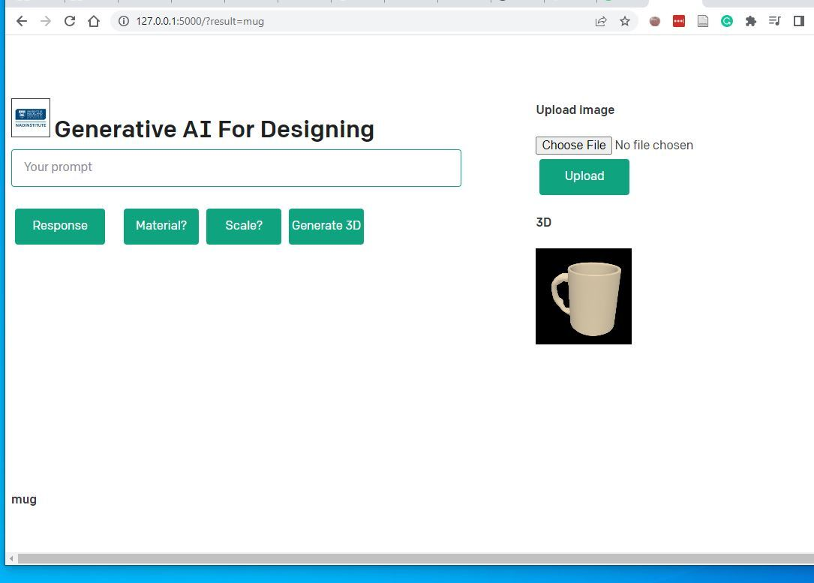

# Conversational and 3D generation  
This model is interactive through a web-based application using Python Flask.  
Converstation: chatGPT  
3D generation: Shap-e (from either text or image)  

Example:  
